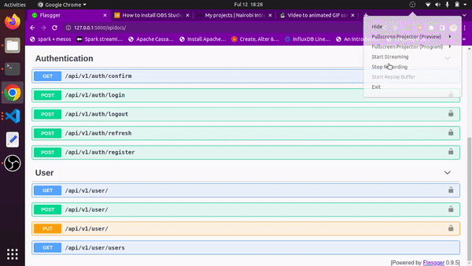

# user-management-service

> A Flask service for managing user registration, authentication and authorization.

<p align="center">
  
  
  
  
  
  
  
  
  
  
  
  
  
  
  
</p>


## Project Overview
This is a simple web application that makes the management of users easier. It enables a new user to register for an account and authenticates and authorizes registered users. It is built with flask and deployed to AWS Beanstalk.

## Working

It's pretty easy to use the application. On the home page (http://localhost:5000/apidocs):

 1. Create an account (post details through registre route)
 2. Confirm your email address (paste the link given after registration into a browser).
 3. Access all the sites functionality.

 <p align=center>
  
</p>

 ## Features

This application has several features including:

1. Deployed to an AWS EBS using Codedeploy.
2. Versioned using git and Hosted on GitHub.
3. Auto-deployed to AWS using AWS CodePipeline.
4. Uses gunicorn as the application servers.
5. Uses an Application Load Balancer to redirect traffic to the frontend
6. Uses AWS Opensearch and Firehose for logging.
7. Uses AWS SES to send confirmation emails.
8. Uses JWT to authorize users.

## Local Setup

Here is how to set up the application locally:

  1. Clone the application repo:</br>

      ```sh
      git clone https://github.com/twyle/user-management-service.git
      ```

  2. Navigate into the cloned repo:

      ```sh
      cd user-management-service
      ```

  3. Create a Virtual environment:

      ```sh
      python3 -m venv venv
      ```

  4. Activate the virtual environmnet:

      ```sh
      source venv/bin/activate
      ```

  5. Install the project dependancies:

      ```sh
      pip install --upgrade pip # update the package manager
      pip install -r requirements.txt  
      ```

  6. Create the environment variables for each service:

      ```sh
      touch .env
      ```

      Then paste the following into the file:

      ```sh

        FLASK_APP=manage.py
        FLASK_DEBUG=True
        FLASK_ENV=development

        POSTGRES_HOST=<YOUR_COMPUTER_IP_ADDRESS>
        POSTGRES_DB=lyle
        POSTGRES_PORT=5432
        POSTGRES_USER=postgres
        POSTGRES_PASSWORD=lyle

      ```

      Then create the database secrets:

      ```sh
      cd services/database
      touch .env
      ```

      Then paste the following into the file:

      ```sh
        POSTGRES_DB=lyle
        POSTGRES_PORT=5432
        POSTGRES_USER=postgres
        POSTGRES_PASSWORD=lyle
      ```

  7. Start the database containers:

      ```sh
      docker-compose -f database/docker-compose.yml up --build -d
      ```

  8. Create the database migrations:

      ```sh
      flask db migrate -m "Initial migration."
      flask db upgrade
      python manage.py seed_db
      ```

  9. Start the services:

      ```sh
      python manage.py run
      ```

  10. View the running application

      Head over to http://0.0.0.0:5000/apidocs 