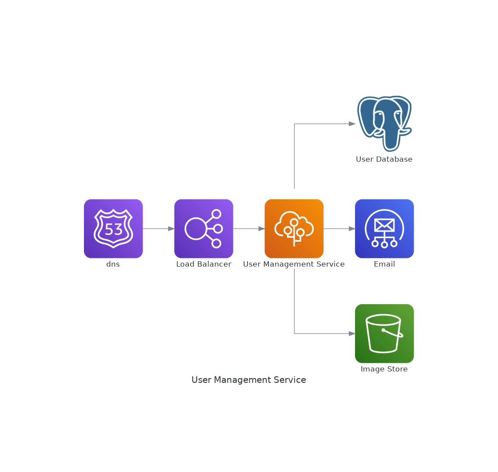

# user-management-service

> A Flask service for managing user registration, authentication and authorization.

  
  
  
  
  
  
  
  
  
  
  
  
  
  
  

## Project Overview
This is a simple web application that makes the management of users easier. It enables a new user to register for an account and authenticates and authorizes registered users. It is built with flask and deployed to AWS Beanstalk.